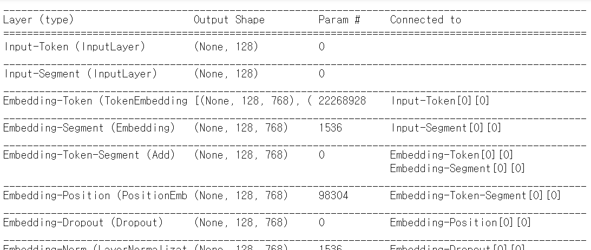
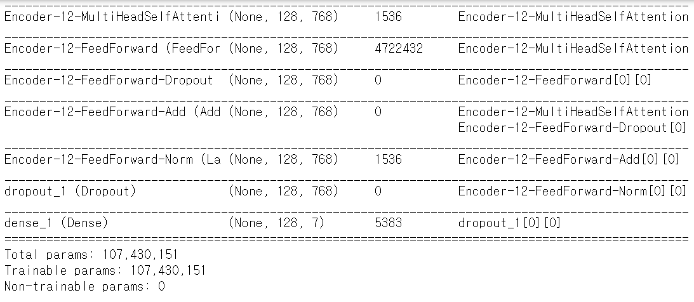

# BERT_NER

**이 repository는 "BERT 실용교육 한국인공지능아카데미"에서 진행하는 미니해커톤에서 사용한 코드를 정리한 repository입니다.**

[관련 코드는 https://github.com/dmis-lab/biobert 을 참고하여 수정, 작성하였습니다]

### 1. 주제

#### : BERT를 이용한 키워드 추출

​    

### 2. 목적

#### 1) BERT모델을 이용하여 BIO tagging data로 fine-tuning 

: layer 하나를 추가하여 다양한 NLP task를 수행할 수 있는 bert모델의 특성을 이해하고, 직접 키워드 추출이 가능한 layer를 구현해본다.

#### 2) 기존의 biobert는 tensorflow로 이루어져 있어 코드를 이해하는데 어려움 多 

 : 이를 keras로 수정하여 코드 이해도를 높인다.


### 3. 주제 설명

: 고려대학교 **biobert weight**를 이용하였다. 

  이를 사용한 이유는 우리가 사용할 데이터가 medical 관련 data이기 때문이다.

   biobert는 biobert weight는 PubMed, PMC로 pretrain된 weight이므로 본 프로젝트에서 사용하는 데이터에서

   키워드 추출을 더 효과적으로 할 수 있기때문이다.

: fine-tuning을 위해 **마지막 layer를 추가하여 키워드 추출**을 할 수 있도록 하였다.

: fine tuning에 사용한 data - BC5CDR-disease의 train, validation, test data (BIO tagging 된 data)


### 4. 코드 요약 

#### < keras bert에 알맞은 input data로 변환하기 위한 함수 및 클래스>

##### **1. _read_data(input_fille)**

- 본래 data를 읽어와 max_sequence_len(30) 길이의 문장들로 잘라준다

  : [문장, labels] 형식의 examples 생성

  : 여기서, BIO 중 BI가 갈라지지 않도록 **pop() 함수**를 이용한다.

  ```python
  def _read_data(input_file):
    with open(input_file) as f:
      lines = []
      words = []
      labels = []
      for line in f:
        contends = line.strip()
        if len(contends) == 0:
          assert len(words) == len(labels)
          if len(words) >30:
            while len(words) > 30:
              tlabel = labels[:30]
              for tidx in range(len(tlabel)):
                if tlabel.pop() == 'O':
                  break
              l = ' '.join([label for label in labels[:len(tlabel)+1] if len(label) > 0])
              w = ' '.join([word for word in words[:len(tlabel)+1] if len(word) > 0])
              lines.append([l,w])
              words = words[len(tlabel)+1:]
              labels = labels[len(tlabel)+1:]
          if len(words) == 0:
            continue
          l = ' '.join([label for label in labels if len(label) > 0])
          w = ' '.join([word for word in words if len(word) > 0])
          lines.append([l, w])
          words = []
          labels = []
          continue
        word = line.strip().split()[0]
        label = line.strip().split()[-1]
        words.append(word)
        labels.append(label)
      return lines        
  
  ```


**2. class WordpieceTokenizer(object)**

- 각각의 example들을 **WordPieceTokenizer**로 토큰화

- For example:
      input = "unaffable"

  ​    output = ["un", "##aff", "##able"]

   **<tokenizer의 WordpieceTokenizer 부분>**

  ```python
  class WordpieceTokenizer(object):
    """Runs WordPiece tokenziation."""
  
    def __init__(self, vocab, unk_token="[UNK]", max_input_chars_per_word=200):
      self.vocab = vocab
      self.unk_token = unk_token
      self.max_input_chars_per_word = max_input_chars_per_word
  
    def tokenize(self, text):
      """Tokenizes a piece of text into its word pieces.
      This uses a greedy longest-match-first algorithm to perform tokenization
      using the given vocabulary.
      For example:
        input = "unaffable"
        output = ["un", "##aff", "##able"]
      Args:
        text: A single token or whitespace separated tokens. This should have
          already been passed through `BasicTokenizer.
      Returns:
        A list of wordpiece tokens.
      """
  
      text = convert_to_unicode(text)
  
      output_tokens = []
      for token in whitespace_tokenize(text):
        chars = list(token)
        if len(chars) > self.max_input_chars_per_word:
          output_tokens.append(self.unk_token)
          continue
  
        is_bad = False
        start = 0
        sub_tokens = []
        while start < len(chars):
          end = len(chars)
          cur_substr = None
          while start < end:
            substr = "".join(chars[start:end])
            if start > 0:
              substr = "##" + substr
            if substr in self.vocab:
              cur_substr = substr
              break
            end -= 1
          if cur_substr is None:
            is_bad = True
            break
          sub_tokens.append(cur_substr)
          start = end
  
        if is_bad:
          output_tokens.append(self.unk_token)
        else:
          output_tokens.extend(sub_tokens)
      return output_tokens
  
  
  ```

  

**3. convert_single_example(ex_index, example, label_list, max_seq_length,tokenizer)**

- 최종 input data 생성 (train, validation, test data 각각에 대해 동일한 방식으로 생성)

  **train_x** : input_ids, segment_ids 

  **train_y** :  label_ids

  

- 이때, train_y 데이터의 경우 input으로 넣어준 ***target 데이터와 동일한 형태로 맞춰주기 위해 one-hot vector형태로*** 바꿔줌

  ```python
  from tensorflow.keras.utils import to_categorical
  train_y_hot = to_categorical(train_y)
  ```

- label_map:  {'B': 1, 'I': 2, 'O': 3, 'X': 4, '[CLS]': 5, '[SEP]': 6}

  - [PAD]의 경우 코드상에서 0으로 처리

  - B/I/O이외에 <u>tokenize된 글자를 하나의 단어로 인식하기 위해 X를 추가로 사용</u>

    ```python
     for i, word in enumerate(textlist):
            token = tokenizer.tokenize(word) 
            tokens.extend(token)
            label_1 = labellist[i]
            for m in range(len(token)):
                if m==0:
                    labels.append(label_1)
                else:
                    labels.append("X")
    ```

- [PAD]와 [PAD]가 아닌 영역을 구분해주는 label_mask는 사용하지 않음

-----------------

###  NER task를 위한 output layer 구현

- **PAD를 포함한 label이 총 7개**

  -> output_layer에서 각 token별로 output크기가 label개수(7개)에 맞게 나오도록 함

  -> **categorical_crossentropy** 사용

```python
def get_bert_finetuning_model(model):
    inputs = model.inputs[:2] 
    dense = model.output
    out = keras.layers.Dropout(0.2)(dense)
    output_layer=keras.layers.Dense(7, activation='softmax')(out)
    model = keras.models.Model(inputs, output_layer)
    model.compile(       
      optimizer=RAdam(learning_rate=LR, weight_decay=0.001),
      loss="categorical_crossentropy",
      metrics=["categorical_accuracy"])
    return model 
```

​         

### Model Summary



  

 4 Epoch로 했을때 정확도 : 98% 

